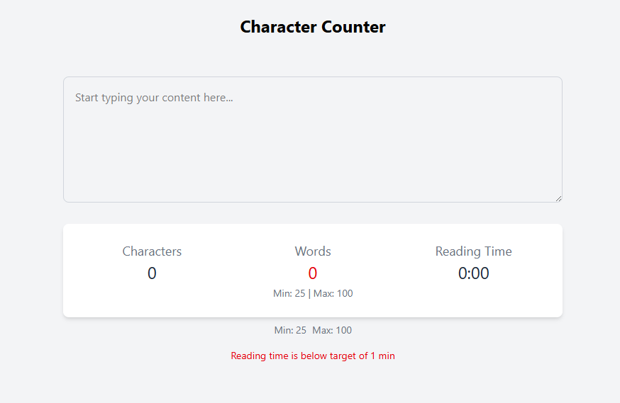
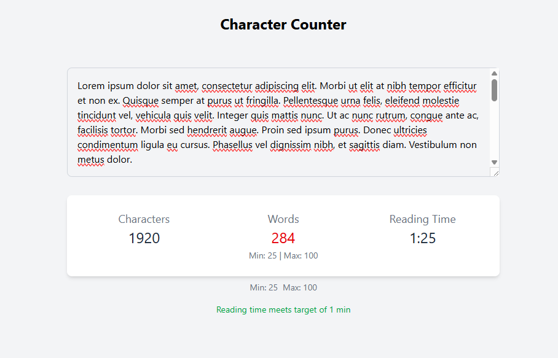

## Character Counter

## Project description

An interactive React app that tracks text input in real time — counting characters, words, and estimating reading time. Built as part of a frontend lab focused on state management, event handling, and component communication using React with TypeScript and Tailwind CSS.

## Table of contents

- [Overview](#overview)
  - [The challenge](#the-challenge)
  - [Screenshot](#screenshot)
  - [Built with](#built-with)
  - [What I learned](#what-i-learned)
  - [Continued development](#continued-development)
- [Author](#author)
- [Acknowledgments](#acknowledgments)

## Overview

This project was built as part of a lab that simulates a real-world content management use case. I created a character counter component that provides live feedback as users type — showing the number of characters, words, and an estimated reading time.

The goal was to better understand how to manage state in React, handle user events, and use props and callbacks to connect components. This app could be used in a writing or blogging platform to help writers stay on track with their word count and content length goals.

### The challenge

The challenge was to build a component-based React application that:

- Tracks live text input and updates statistics in real time
- Uses React hooks like 'useState'for state management
- Passes props and uses callback functions to communicate between components
- Responds to user input with visual feedback
- Provides flexibility through reusable components

I also had to calculate and display statistics like:
- Total character count
- Word count
- Estimated reading time (in minutes)

This helped me practice thinking through how data flows through components in a React app.

### Screenshot

### Built with

- React
- TypeScript
- Tailwind CSS
- JSX

### What I learned

This project helped me get more comfortable with core React concepts like:
- Passing props and using callback functions
- Managing local state using the 'useState' hook
- Creating flexible, reusable components that work together
- Conditional rendering based on user input

### Continued development

While I made strong progress in this lab, I’m still early in my React learning journey. Here’s what I plan to focus on next:

- Building more small projects to reinforce React fundamentals
- Practicing 'useEffect', 'useContext', and other React hooks
- Getting better at passing props between deeply nested components
- Using conditional rendering more confidently in real-world interfaces
- Improving accessibility and making sure UI feedback is clear for all users
- Writing clean, maintainable code that scales across components

My long-term goal is to confidently build full, interactive apps with React — using thoughtful component design, solid state management, and clean code structure.

## Author

- GitHub - [KaeLoma777](https://github.com/KaeLoma777)

## Acknowledgments
- My coding bootcamp instructors and mentors
- I'm incredibly grateful to my classmate [Yusuf Bolden](https://github.com/YusufBolden) for generously taking the time to teach me React fundamentals and walk me through the project step by step. This project wouldn't have been possible without their guidance and support.